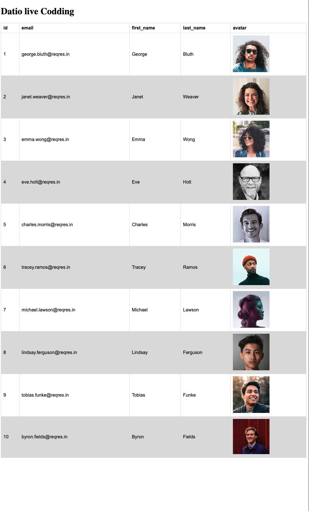

# Technical live Code -- Frontend development

# <h3>Bienvenido a la prueba de acceso a Datio</h3>

En esta prueba de código buscamos se busca ver las destrezas y autonomía a la hora de desarrollar una feature o arreglar un fix.
Más abajo encontrarás las pautas para poder correctamente la prueba.

## <h3>Objeto de la prueba</h3>

Dadas la API: https://reqres.in/api

- Seleccionar el endpoint /users/ y mostrar un total de 10 resultados por cada consulta al servicio del mismo.
- Desarrollar un componente que liste, en forma de tabla, los resultados obtenidos de la llamada.
- Para los estilos de la tabla se proporcionan los siguientes estilos en .css:

  ```
  table {
  font-family: arial, sans-serif;
  border-collapse: collapse;
  width: 100%;
  }

  td,
  th {
  border: 1px solid #dddddd;
  text-align: left;
  padding: 8px;
  }

  tr:nth-child(even) {
  background-color: #dddddd;
  }
  ```

- La prueba deberá contener al finalizar al menos 3 commits, y una pull-request a la rama origen (staging). </br>

## <h3>Aspecto final prueba</h3>

- El resultado final de la prueba, debe parecerse lo más posible al resultado de abajo.



## Technologies

Project is created with:

- React.js: 18.0.2
- React-Redux: 7.2.4
- Redux-Thunk: 2.3.0
- Axios: 0.21.1
